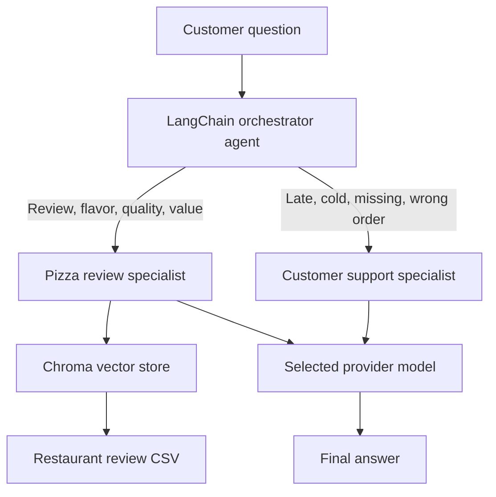

## Pizza Review and Customer Support Agent

This is a small retrieval-augmented generation (RAG) application for a pizza restaurant. It uses a selected OpenAI, Azure OpenAI, or Amazon Bedrock model to answer customer questions.

## Business use case

A pizza restaurant receives two common kinds of customer messages:

- Questions about menu quality, flavors, crust, ingredients, or value.
- Requests for help when an order is late, cold, missing items, or otherwise incorrect.

The application routes each message to a specialist. The pizza-review specialist searches historic restaurant reviews before answering. The customer-support specialist drafts a concise, empathetic response with an appropriate next step.

## Features, tools, and technology stack

### Features and LangChain tools

- **Orchestrator agent:** reads the customer message and selects the appropriate specialist.
- **`pizza_review_specialist` tool:** retrieves the five most relevant historic reviews, then summarizes their evidence.
- **`customer_support_specialist` tool:** drafts a concise, empathetic response for late, cold, missing, or incorrect orders.
- **Persistent review search:** indexes the included restaurant-review CSV once and reuses it on later runs.
- **Offline unit tests:** mock provider and retrieval calls, so they run without credentials or model costs.

### Technology stack

| Technology | Purpose |
| --- | --- |
| Python | Application language. |
| LangChain | Creates the specialist and orchestrator agents, plus their tools. |
| Chroma | Local persistent vector database for semantic review search. |
| Pandas | Loads the restaurant-review CSV. |
| OpenAI, Azure OpenAI, or Amazon Bedrock | Configurable chat and embedding provider. |
| `uv` | Dependency and virtual-environment management. |
| `unittest` | Built-in Python framework for the offline unit tests. |

## Architecture



## Example process flows

### Review question

Customer asks:

```text
What do customers say about the cheese pizza and crust?
```

1. `answer_question()` sends the message to the LangChain orchestrator.
2. The orchestrator identifies this as a review question and calls `pizza_review_specialist`.
3. The tool converts the question into an embedding and searches Chroma for the five most similar reviews.
4. The pizza-review agent receives the reviews as evidence and writes a grounded answer.
5. The orchestrator returns that answer to the customer.

### Order problem

Customer asks:

```text
My delivery was late and the pizza arrived cold.
```

1. `answer_question()` sends the message to the LangChain orchestrator.
2. The orchestrator identifies an order issue and calls `customer_support_specialist`.
3. The support agent receives the issue, acknowledges the inconvenience, and suggests an appropriate next step.
4. The orchestrator returns the customer-support response.

## Setup

1. Install dependencies:

   ```powershell
   uv sync
   ```

2. Copy `.env.example` to `.env` and configure one provider:

   ```ini
   LLM_PROVIDER=openai
   OPENAI_API_KEY=...
   OPENAI_MODEL=gpt-5.4-nano
   OPENAI_EMBEDDING_MODEL=text-embedding-3-small
   ```

   Set `LLM_PROVIDER` to `azure` or `bedrock` instead to use those providers and their matching credentials.

3. Run the sample application:

   ```powershell
   uv run agent
   ```

4. Run the unit tests:

   ```powershell
   uv run python -m unittest discover -s tests
   ```

## Prompt and rationale examples

### Pizza-review question

Prompt:

```text
What do customers say about cheese pizza and the crust?
```

Rationale: this is a question about review evidence, so the orchestrator calls the pizza-review specialist. That specialist retrieves the most relevant review documents and answers only from those documents.

### Customer-support question

Prompt:

```text
My delivery arrived 45 minutes late and the pizza was cold.
```

Rationale: this is an operational order issue, so the orchestrator calls the customer-support specialist. It should acknowledge the inconvenience and suggest a realistic next step, such as contacting the restaurant for a replacement or refund.

### Boundary case

Prompt:

```text
Can you guarantee that every pizza will arrive in 20 minutes?
```

Rationale: the support specialist should not make a promise the restaurant cannot guarantee. It should explain the limitation and offer the appropriate escalation path instead.
